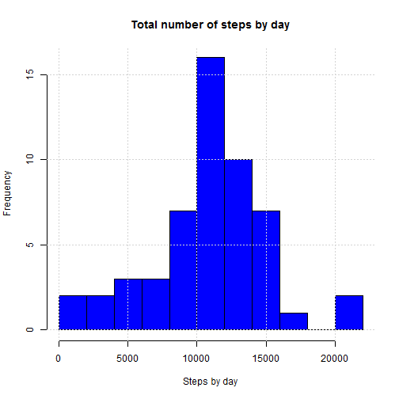
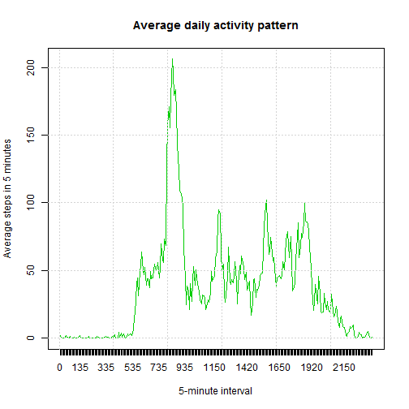
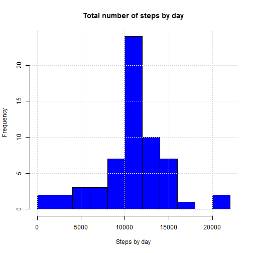
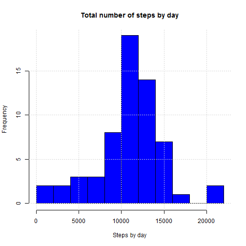
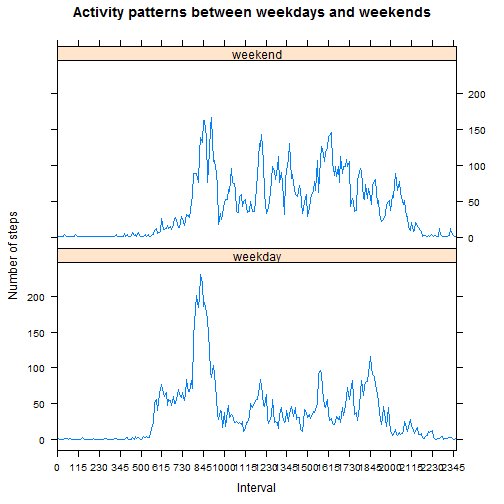
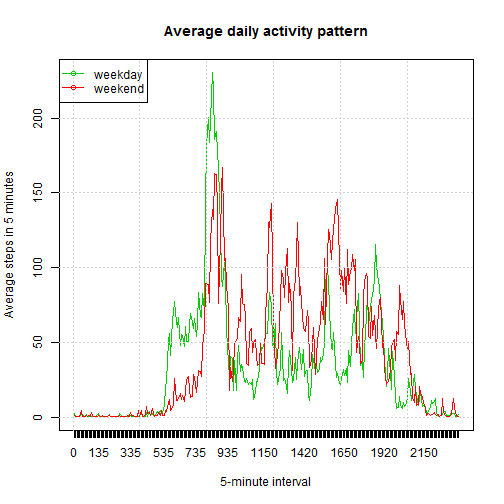

## Loading and preprocessing the data


After loading the data, using the 'summary' function it is possible to see that there are 2304 missing values (NAs) in the data set. To ignore the NAs a new data set 'ndatact' without NAs was created.


```r
datact <- read.csv("activity.csv")
#str(datact)
any(is.na(datact[,1])) #steps has NAs
```

```
## [1] TRUE
```

```r
ndatact <- datact[!is.na(datact[,1]),] # without NAs
#summary(ndatact)
```

## What is mean total number of steps taken per day?

Excluding the missings, the mean total number of steps by day is 10766, and the median is almost the same, 10765 steps. 


```r
stepday <- tapply(ndatact[,1],ndatact[,2],sum,na.rm=TRUE) # steps by day
fstepday <- stepday[!is.na(stepday)] #to avoid empty days
h1 <- hist(fstepday,breaks=10,freq=TRUE,col=4,main="Total number of steps by day",xlab="Steps by day")
grid()
```

 

```r
summary(fstepday,digits=15)
```

```
##    Min. 1st Qu.  Median    Mean 3rd Qu.    Max. 
##      41    8841   10765   10766   13294   21194
```

## What is the average daily activity pattern?

On average across all the days in the dataset, the 835 5-minute interval contains the maximum number of steps, being equal to 206.2 steps. The mean is 37.4 steps by 5-minutes.


```r
astep5m <- tapply(ndatact[,1],ndatact[,3],mean,na.rm=TRUE) # steps in 5-minutes
plot(astep5m,type="l",col=3,main="Average daily activity pattern",ylab="Average steps in 5 minutes",
     xlab="5-minute interval",xaxt="n")
grid()
axis(1, at=1:length(astep5m), labels=names(astep5m))
```

 

```r
summary(astep5m,digits=15)
```

```
##    Min. 1st Qu.  Median    Mean 3rd Qu.    Max. 
##    0.00    2.49   34.11   37.38   52.83  206.17
```

```r
#names(astep5m)[which.max(astep5m)]
names(which.max(astep5m))
```

```
## [1] "835"
```

## Imputing missing values

The total number of missing values in the dataset is 2304 (i.e. the total number of rows with NAs). As we can see there are 8 days without any value.


```r
sum(is.na(datact[,1])) #rows with NAs
```

```
## [1] 2304
```

```r
nasday <- tapply(ndatact[,1],ndatact[,2],function(x)sum(is.na(x)))
sum(is.na(nasday)) # days whithout any record
```

```
## [1] 8
```

# Using the mean to fill missing values

It is known that the presence of missing days may introduce bias into some calculations or summaries of the data. In order to see this effect, we apply a simple strategy for filling the missing values, using the correspondent mean value for the same 5-minute interval across the sample.

We create a new dataset, 'cdatact',  that is equal to the original dataset but with the missing data filled in.


```r
cdatact <- datact
stepdayt <- tapply(datact[,1],datact[,2],sum) # steps by day
(dates <- names(stepdayt[is.na(stepdayt)])) #days with NAs
```

```
## [1] "2012-10-01" "2012-10-08" "2012-11-01" "2012-11-04" "2012-11-09"
## [6] "2012-11-10" "2012-11-14" "2012-11-30"
```

```r
for (i in seq(along=dates)){ #i=1
  cdatact[is.na(datact$steps)&datact$date==dates[i],1] <- 
    astep5m[names(astep5m)==datact$interval[which(is.na(datact$steps[datact$date==dates[i]]))]]
  }
#ndf=cbind(cdatact,datact) #verify if filling is ok
#sum(ndf[!is.na(ndf[,4]),1]-ndf[!is.na(ndf[,4]),4]) #zero
#summary(cdatact)
```

After filling the missing values, the mean total number of steps by day is 10766, so it is the same value estimated excluding missing values. This is because the missing were excluded in the first computation, and because we use the mean value to replace the missing, in this second case. 

The median steps by day changed from 10765 to 10766 steps. In this case the impact on mean and median appear marginal, the 8 days are add to the 10000 - 12000 bin of the histogram.


```r
cstepday <- tapply(cdatact[,1],cdatact[,2],sum,na.rm=TRUE) # steps by day
h2 <- hist(cstepday,breaks=10,freq=TRUE,col=4,main="Total number of steps by day",xlab="Steps by day")
grid()
```

 

```r
summary(cstepday,digits=15)
```

```
##    Min. 1st Qu.  Median    Mean 3rd Qu.    Max. 
##      41    9819   10766   10766   12811   21194
```

```r
data.frame(h1$mids,h1$counts,h2$mids,h2$counts)
```

```
##    h1.mids h1.counts h2.mids h2.counts
## 1     1000         2    1000         2
## 2     3000         2    3000         2
## 3     5000         3    5000         3
## 4     7000         3    7000         3
## 5     9000         7    9000         7
## 6    11000        16   11000        24
## 7    13000        10   13000        10
## 8    15000         7   15000         7
## 9    17000         1   17000         1
## 10   19000         0   19000         0
## 11   21000         2   21000         2
```

# Using linear regression to fill missing values

In this specific case, using the mean of 5-minute interval across the sample does not appear a good strategy for filling missings. We know that physical activities could be also different among days of the week. 

We try a second strategy to fill missings. In this case we estimate a linear regression model to predict steps with dummy variables that were defined for each day of the week and for each 5-minute interval of the day, and without constant to avoid perfect collinearity. 

After that we use the predicted values to fill the missings in the 'steps' column, replacing negative predictions with zero. The new data set is 'c2datact'.


```r
wd <- weekdays(as.Date(datact[,2],format="%Y-%m-%d"),abbreviate = TRUE)
m1 <- lm(datact[,1]~0+factor(datact[,3])+factor(wd))
pred_m1 <- predict(m1,data.frame(factor(datact[,3]),factor(wd)))
any(pred_m1<0) #has negatives
```

```
## [1] TRUE
```

```r
c2datact <- datact
c2datact[is.na(datact$steps),1] <- pred_m1[is.na(datact$steps)]
c2datact[(c2datact[,1]<0),1] <- 0 #replace negatives with zero
```

After filling the missing values with linear regression the mean total number of steps by day is 10838, so it is bigger than the value estimated when excluding missing values. The median steps by day also increased to 11015 steps. 

With this second strategy we can see the impact on mean and median are important. In this second case the 8 days were distributed to tree bins of the histogram.


```r
c2stepday <- tapply(c2datact[,1],c2datact[,2],sum,na.rm=TRUE) # steps by day
h3 <- hist(c2stepday,breaks=10,freq=TRUE,col=4,main="Total number of steps by day",xlab="Steps by day")
grid()
```

 

```r
summary(c2stepday,digits=15)
```

```
##    Min. 1st Qu.  Median    Mean 3rd Qu.    Max. 
##      41    8918   11015   10838   12811   21194
```

```r
data.frame(h1$mids,h1$counts,h2$mids,h2$counts,h3$mids,h3$counts)
```

```
##    h1.mids h1.counts h2.mids h2.counts h3.mids h3.counts
## 1     1000         2    1000         2    1000         2
## 2     3000         2    3000         2    3000         2
## 3     5000         3    5000         3    5000         3
## 4     7000         3    7000         3    7000         3
## 5     9000         7    9000         7    9000         8
## 6    11000        16   11000        24   11000        19
## 7    13000        10   13000        10   13000        14
## 8    15000         7   15000         7   15000         7
## 9    17000         1   17000         1   17000         1
## 10   19000         0   19000         0   19000         0
## 11   21000         2   21000         2   21000         2
```

## Are there differences in activity patterns between weekdays and weekends?

For this part we use the 'c2datact' dataset with the filled-in missing values. To create the new factor variable we use the 'weekdays()' function to get the days, but as the result is a text, we prefer to use the 'wday' component of a 'POSIXlt' object that gives us numeric days, with 0 being equal to Sunday and so on.  

The new factor variable 'fwd' has two levels – “weekday” and “weekend” indicating whether a given date is a weekday or weekend day.

The activity appears different between weekdays and weekends. On average the mean and median steps in 5-minute interval are bigger on weekends than weekdays, but the maximun steps is bigger on weekdays. This maximum is registered around 835 on weekdays and 915 on weekends.

In general, around 530 to 905 intervals there is more activity (steps) during weekdays than on weekeends, maybe because the person wake up ealier on weekdays (see the last plot).


```r
c2datact$nwd <- as.POSIXlt(as.Date(datact[,2],format="%Y-%m-%d"))$wday
c2datact$fwd <- factor(ifelse(c2datact$nwd>=1&c2datact$nwd<=5,1,0),levels=c(1,0),
                    labels=c("weekday","weekend"))
#table(c2datact$nwd,c2datact$fwd)
wdstep5m <- with(subset(c2datact, fwd == "weekday"),
              tapply(steps,interval,mean,na.rm=TRUE)) # steps in 5-minutes weekday
westep5m <- with(subset(c2datact, fwd == "weekend"),
              tapply(steps,interval,mean,na.rm=TRUE)) # steps in 5-minutes weekend

library(lattice)
final <- rbind(data.frame(steps=wdstep5m,wd="weekday",
                       interval=factor(1:length(wdstep5m),labels=names(wdstep5m))),
            data.frame(steps=westep5m,wd="weekend",
                       interval=factor(1:length(westep5m),labels=names(westep5m))))
xyplot(steps ~ interval | wd, data = final,type="l",
        xlab = "Interval", ylab = "Number of steps",
        layout = c(1,2),main="Activity patterns between weekdays and weekends",
       scales=list(
    x=list(
      at=seq(1,length(wdstep5m),15),
      labels=names(wdstep5m)[seq(1,length(wdstep5m),15)] )
    ))
```

 

```r
by(final[, 1], final[,"wd"], summary, digits=15)
```

```
## final[, "wd"]: weekday
##    Min. 1st Qu.  Median    Mean 3rd Qu.    Max. 
##    0.32    2.41   25.81   35.69   50.86  230.38 
## -------------------------------------------------------- 
## final[, "wd"]: weekend
##    Min. 1st Qu.  Median    Mean 3rd Qu.    Max. 
##    0.71    1.95   33.05   43.08   75.37  167.35
```

```r
by(final[, 1], final[,"wd"], function(x) names(wdstep5m)[which.max(x)])
```

```
## final[, "wd"]: weekday
## [1] "835"
## -------------------------------------------------------- 
## final[, "wd"]: weekend
## [1] "915"
```

```r
plot(wdstep5m,type="l",col=3,main="Average daily activity pattern",ylab="Average steps in 5 minutes",
     xlab="5-minute interval",xaxt="n")
lines(westep5m,col=2)
grid()
axis(1, at=1:length(wdstep5m), labels=names(wdstep5m))
legend("topleft",c("weekday","weekend"),col=c(3,2),pch=1,lty=1)
```

 

```r
#names(wdstep5m)[wdstep5m-westep5m>20 ]
```

